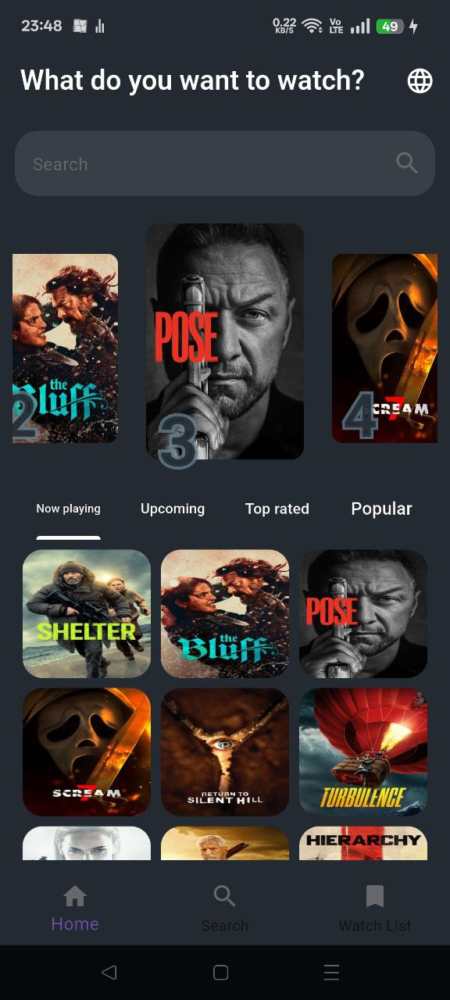
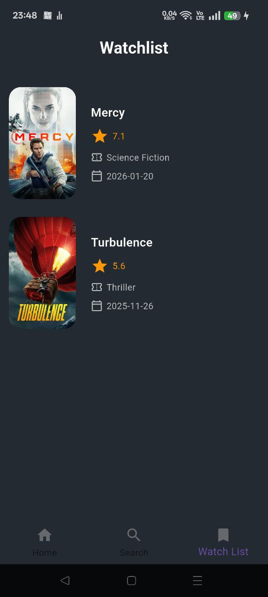

# 🎬 Movies App
A Flutter application for browsing movies using TMDB API.
---

## 📸 Overview

Movies App lets users explore films across four categories, view full movie details including cast and reviews, search for any title, and manage a personal watchlist.

---
## 📸 Screenshots

| Splash | Home | Watchlist | Details |
|---|---|---|---|
|  |  |  |  |


## ✨ Features

### 🎥 Movies Browsing
- Now Playing Movies
- Popular Movies
- Top Rated Movies
- Upcoming Movies

### 🔍 Search
- Search movies by name

### 🎞️ Movie Details
- Movie overview
- Rating & release date
- Cast info
- User reviews

### 🔖 Watchlist
- Add / Remove movies
- Local storage using Hive

### 🌐 Localization
- Arabic & English support
---

## 🛠️ Tech Stack

| Technology | Usage |
|---|---|
| **Flutter** | UI Framework |
| **BLoC** | State Management |
| **Dio** | API Calls |
| **Hive** | Local Storage |
| **Easy Localization** | AR / EN Support |
| **Carousel Slider** | Movie Slider UI |
| **TMDB API** | Movie Data Source |

---

## 🚀 Getting Started

### 1. Clone the repo
```bash
git clone https://github.com/your-username/movies-app.git
cd movies-app
```

### 2. Install dependencies
```bash
flutter pub get
```

### 3. Run the app
```bash
flutter run
```

---

## 🔑 API

This app uses the [TMDB API](https://www.themoviedb.org/documentation/api).
Replace the Bearer token in the cubits with your own API key from TMDB.---

## 📦 Dependencies
```yaml
flutter_bloc: ^9.1.1
bloc: ^9.1.0
dio: ^5.9.0
hive: ^2.2.3
hive_flutter: ^1.1.0
easy_localization: ^3.0.8
carousel_slider: ^5.1.1
flutter_svg: ^2.2.1
meta: ^1.16.0
```

---

## 👨‍💻 Author

Made with ❤️ by **Mohammed Hassanien**

